# Leo

[[toc]]

## Gameplan

Leo is a good all-rounder with some strong fundamental tools.
Their primary focuses are wall pressure through mixups involving tools like `db+4`
and utilising their `KNK` stance as well as whiff punishing using tools like `df+2`

Leo has very strong wall damage and amazing carry to get there easily.

Leo has very good block and while standing punishment tools with a decent `1` jab
and `ws4` which is a safe on block `i11` mid with a heat engager follow up in `ws4,1+2`

They do however have a fairly poor counter hit game and low game outside of very
close range

Another weakness is they are quite linear with poor tracking on a lot of their good
moves which leaves them susceptible to being side stepped or walked

## Whiff Creation

Leo has amazing whiff punishment and as such we can start to try and develop a gameplan
around using moves with pushback to try and create these opportunities some moves
we can use for this include the following:

| Move    | Block | Hit | CH   |
| ------- | ----- | --- | ---- |
| `df+4`  | -6    | +5  |      |
| `d+4`   | -11   | +0  |      |
| `f+3+4` | 0     | +8  | +71a |
| `CD.2`  | -9    | +9  |      |

Options the opponent could use after one of these are:

- They could whiff their follow up attack (This is the ideal outcome )
- They could use a long range move that we can't backstep from, most of these are
  slow however so we could attempt to interrupt
- They could go for a dash in to make sure they don't whiff, if they do this we
  can play outside of our frames and go for the interrupt
- They could go defensive, if they do this we can take the upperhand and use it
  to continue pushing our offense

::: details

`df+4`
~ This is our go-to whiff creation tool. It's a fast `i13` mid poke which has both
great range and great pushback  

`d+4`
~ This is our best low for whiff creation, it has great tracking, range and pushback

`f+3+4`
~ This is a high move with huge pushback, range and even has chip damage  
Gives big reward on counterhit as well

`CD.2`
~ This comes with good range, good pushback and threatens the second hit with
`CD.2,1` on hit  
On hit we're left at +9 relatively close to the opponent so can go for a `f+3+4`

:::

## Space Trapping

This is again to try and bait out whiffs but is done differently to the above.  
  
What we're aiming for here is to use our moves at max range to try and bait them
into missing the retaliation.  
This requires us to be aware of the maximum range of our moves and the space
between us and our opponent at all times  
Because of this it is a more advanced and situational technique compared with the
above

Good moves for this include:

- `BOK.2`
- `SS.1+2`

## Poke Game

Fast and safe moves

| Move    | Importance  | Block | Hit  | CH    | Notes          |
| :---:   | :---:       | ---   | ---  | ---   | ---            |
| `1`     | Core        | +1    | +8   | ---   |                |
| `df+1`  | Core        | -1    | +7   | ---   |                |
| `d+4`   | Core        | -11   | 0    | ---   |                |
| `4`     | Secondary   | -7    | +6   | +31a  |                |
| `CD.1`  | Secondary   | -12   | -1   | +11   |                |
| `f+4`   | Secondary   | +9    | +15g | +19   | Recovers in KNK|

::: details
`1` *(Close Range)*
~ Basic jab. Do NOT use 1,4 on block!

`df+1` and `df+1,2` *(Close Range)*
~ Generic df+1, -1 good for checking mid.  
High 2 extension gives good reward on counterhit  
Can also get LTG on hit with `df+1,2~1+2`

`d+4` *(Midrange)*
~ Minus on hit low with tracking.  
Can use d+4,2 to make it less minus and step or take back turn, threatens LTG enabling

`4` *(Close Range)*
~ 12f magic 4, gives a decent mini combo on counter hit

`CD.1` *(Close Range)*
~ High crushing low. Minus on hit but gives guaranteed ws4,1+2 heat engager on CH

`f+4` *(Close Range)*
~ Mid that enters KNK stance for mixing.  
Faster and more reliable than b1,4 against better opponents  
Lacks range and tracking though
:::

## Counterhit Game

Stronger against enemy attacks. Often have evasive, parry or crush properties

| Move      | Importance | Block | Hit  | CH   |
| --------- | ---------- | ----- | ---- | ---- |
| `1,2,1,1` | Core       | -13   | +12a |      |
| `1,2,1,4` | Core       | -6    | +32a |      |
| `df+1,2`  | Core       | -6    | +9d  | +34d |
| `4`       | Core       | -7    | +6   | +31a |
| `df+2+3`  | Core       | -12   | +5   | +21d |
| `f+4`     | Core       | +9    | +15g | +19  |
| `d+2`     | Core       | +4c   | +9c  | +56a |
| `CD.1`    | Secondary  | -12   | -1   | +11  |

::: details

`1,2,1,1` / `1,2,1,4`
~ String follow ups that can be useful for counterhitting after 1,2.  
First three hits are all high though so be careful

`df+1,2`
~ On counterhit can get a guaranteed mini combo with `f+1+2`  
Can also get LTG on hit with `df+1,2~1+2`

`4`
~ 12f magic 4, gives a good mini combo with `BOK.1+2`, `d+3+4`

`df+2+3`
~ Slow high crushing low, but not overly punishable, full combo on counterhit

`f+4`
~ Mid that enters KNK stance for mixups.  
Guaranteed `KNK.1,2` heat engager on counterhit

`d+2`
~ Forces crouch on block at +4 and gives full combo on counterhit

`CD.1`
~ High crushing low.  
Gives guaranteed `ws4,1+2` heat engager on counter hit
:::

## Mixup Game

Useful moves against a guarding opponent

| Move      | Importance | Block | Hit  | CH   |
| --------- | ---------- | ----- | ---- | ---- |
| `df+2+3`  | Core       | -12   | +5   | +21d |
| `CD.1`    | Core       | -12   | -1   | +11  |
| `f+4`     | Core       | +9    | +15g | +19  |
| `d+2`     | Core       | +4c   | +9c  | +56a |
| `f,f,F+3` | Secondary  | +6    | +13a |      |
| `CD.2,1`  | Secondary  | -6    | +10  | +30d |
| `d+4`     | Secondary  | -11   | +0   |      |

::: details
`df+2+3`
~ Slow high crushing low, but not overly punishable, full combo on counterhit

`CD.1`
~ High crushing low.  
Gives guaranteed `ws4,1+2` heat engager on counter hit

`f+4`
~ Mid that enters KNK stance for mixups.  
Guaranteed `KNK.1,2` heat engager on counterhit

`d+2`
~ Forces crouch on block at +4 and gives a full combo on counter hit

`f,f,F+3`
~ Basic slash kick. Plus on block

`CD.2,1`
~ Safe mid, mid string with great range.  
Counter hits from either hit lead into a mini combo.  
Has a KNK cancel

`d+4`
~ Mid that enters KNK stance for mixups.  
Guaranteed `KNK.1,2` heat engager on counterhit
:::

## Approach Moves

Useful moves when moving in on the opponent

| Move      | Block | Hit  | CH   |
| --------- | ----- | ---- | ---- |
| `f,f,F+3` | +6    | +13a |      |
| `CD.2,1`  | -6    | +10  | +30d |

::: details
`f,f,F+3`
~ Basic slash kick. Plus on block

`CD.2,1`
~ Safe mid, mid string with great range.  
Counter hits from either hit lead into a mini combo.  
Has a KNK cancel
:::

## Oki Moves

Useful against a grounded opponent

| Move      | Importance | Block | Hit  | CH  |
| --------- | ---------- | ----- | ---- | --- |
| `f,F+3`   | Core       | -7c   | +3d  |     |
| `f,F+3~d` | Core       | +0    | +10d |     |
| `BOK.1+2` | Core       | -12   | +15d |     |
| `d+4`     | Secondary  | -11   | +0   |     |

### Ground hit Moves

`df+2+3` / `d+4` / `d+3+4` / `b+1+4` / `ub+3` / `f,F+3` / `iws3` / `CD.1`
/ `BOK.2` / `BOK.1+2` / `KNK.4` / `KNK.1+2` / `KNK.3+4`

### Wake-up catches

`iws1+2`
~ Most reliable and gives LTG

`SS.1+2`
~ More damage but doesn't clip side rolls

### Tools with some Oki

::: details
`CH d+1` / `BOK.3` / `KNK.3+4`
~ `ub+3` Guaranteed  
Wake-up catch possible  
`iws3` sets up `f,f,F+3` if opponent tech rolls (not recommended)

`CH df+1+2`
~ `d+4` guaranteed. Wake-up catch possible.  
`iws3` sets up `f,f,F+3` if the opponent tech rolls

`CH ws3,1,2`
~ `d+4` guaranteed  
Wake-up catch only possible with `df+3`

`KNK.2`
~ Free mixup between `ws3` and `CD.1`

`CD.2,4`
~ Dash in for free `d+4` or `db+2` mixup

`db+4,1`
~ Nothing is guaranteed  
Well-timed f,f,F+3 can catch techrolls to keep momentum

`f+2,4,LTG.3`
~ Wake-Up catch possible with `f,F+2`.  
If close to the wall you get a free `ub+3, d+4,2` or `BOK.2, df+4`

`1+3` throw / `b+2+4` (right kick parry)
~ `d+4` catches every option except b getup.  
f,F+2 catches b getup

`FC.df+3`
~ `ub+3` guaranteed  
`BOK.2` can set up well timed `f,f,F+3` that catches techrolls
:::

### Combo Oki (After tornado)

::: details
`d+1`
~ Spikes the opponent and keeps you at -2.  
You can go to crouch for mixup or stay standing and play around hard knockdown

`ws3 reset`
~ If the opponent does not do an immediate b getup or techroll you can reset with
`ws3` by slightly delaying the input

`b+1,1+2`
~ Oki depends on combo hits (max 7 recommended)  
Puts opponent FDFT at heavy disadvantage  
On techroll you can dash in for a mixup  
If they do b getup you can try to catch with run in `f+1+2`

`f+4 KNKc f+4 (whiff)`
~ Gimmicky option.  
Gives either uninterruptible mix on a techroll or b getup or full reset  
Note `KNK.3` whiffs on techroll left
:::

### Wall Oki

::: details
`BOK.1+2 df+2+3`
~ Techroll gives a free mixup either a FC mixup or delayed `uf+3` or `f,F+2`  
If they don't techroll the opponent is at heavy disadvantage for mixup back into
wall  
If opponent techrolls right can perform well timed `f,f,F+3` to cross up and
side switch

`KNK.1+2 low splat`
~ Pancake flip into a 3-way mixup  
techroll into mixup or eat full reset (`db+4,1` is most reliable)  
Other options are `iws3` and `df+2+3`  
`df+3` can work for mid re-splat option  
Leo can body block techroll left by whiffing well timed `2` jab preventing escape
and keeping frame advantage

`ws1,4,1`
~ Good frame advantage, free mix on techroll, free `d+4` or `iws3` if they
don't  
Can also be used to wake-up catch after `BOK.1+2` but doesn't clip side roll

`ws1+2`
~ If Leo charges LTG puts them at heavy disadvantage  
similar situation to `ws1,4,1` but if they don't tech roll only `d+4`
guaranteed  
If opponent techrolls Leo is still +10 but grounded options more effective  
`iws1+2` can be used as a wake-up catch after a low splat `BOK.1+2`
:::

## Defensive / Panic Moves

| Move    | Block | Hit  | CH  |
| ------- | ----- | ---- | --- |
| `db+3`  | -8    | +38a |     |
| `b+3+4` |       |      |     |
| `f+2+3` | -9    | +11a |     |

::: details
`db+3`
~ Backswing blow with tons of high crush, safe on block some opponents won't be
keen enough to block

`b+3+4`
~ Manual backstep that enters KNK  
`KNK.2` `KNK.3,4` and `KNK.3+4` here can punish whiffs  
Cancel into crouch dash to either take back space or make safer

`f+2+3`
~ Safe high that evades to the right.  
Can be used to evade retaliation or escape pressure
:::

## Tech

### KNK Cancels

Leo can cancel out of KNK quickly in order to get a ws move. This technique can
be used to quickly block out of KNK, in combos with `b+4~1,4` and more. This
technique is also used inside of combos to cancel `f+4` repeatedly into itself
for extremely high wall carry.  
To perform KNK cancel you must press down-forward to go into crouch dash from KNK
and then quickly tap up to cancel the crouch dash  
Notation looks like `f+4~df,n,u`

### iws3 Pickups

Leo can use an instant ws3 in order to pick up a combo after certain moves  
Most importantly `uf+2,1` a safe (steppable) mid-mid launcher if picked up  
Also can pick up from `b+2+3` on CH or parry as well as `CH (CD.2),1`  
  
The input must be done immediately after recovery (for `uf+2,1`) and after a dash
(for `b+2+3` and `CH (CD.2),1`).  
The input should look like `d,df,n,3` or `d,df,f,3` with the `df` and `n` or
`df` and `f` inputs each being one frame each.  
Note that `uf+2,1` has a much simpler pickup with heat burst which also
guarantees a combo

## Best Moves

| Move   | Block     | Hit  | CH   |
| ------ | --------- | ---- | ---- |
| 1      | +1        | +8   |      |
| df+1   | -1        | + 7  |      |
| d4     | -11 ~ -10 | 0    |      |
| df+3   | -9 ~ -7   | +6a  | +27a |
| CD.2,1 | -6        | +10  | +30d |
| CD.1   | -12       | -1   | +11  |
| CD.3+4 | -6        | +13g |      |
| CD.2,4 | -11       | +10d |      |
| d1     | -2        | +5   | +24d |
| d2     | +4c       | +9c  | +56a |
| KNK.2  | -9        | +22a | +58a |
| CH4    | -7        | +6   | +31a |

::: details
`df+1`
~ Good for pressure  
Extension with `df+1,2` which has counterhit knockdown  
on CH knockdown follow with `f+1+2`

`df+3`
~ Homing, Balcony Break and quick

`CD.2,1`
~ Wall crush on hit at +22g  
NC from first hit

`CD.2,4`
~ Unsafe at -11  
Wallsplats  
Can be ducked and stepped

`d1`
~ Very plus, can try for a `df+2` on hit  
Can enter FC with d

`d2`
~ CH Launcher  
Frametraps with `df+1`

`KNK.2`
~ CH Launcher if you see them going in when going into KNK  
Balcony break

`CH 4`
~ Leo still gets a magic 4!  
Gives good mini combo with `BOK.1+2`, `d+3+4`
:::

## Punishes

| Frame | Standing                  | Crouching      | Whiff  |
| ----- | ------------------------- | -------------- | ------ |
| 10f   | 1,4                       | FC.d+1         | 1,4    |
| 11f   | 2,2                       | ws4,1+2 (heat) | df+2   |
| 12f   | ---                       | ws1+2          | db+2,4 |
| 13f   | uf+1,2                    | uf+1,2         |        |
| 14f   | f+2,2   b+2,1+2 (heat) | ---            |        |
| 15f   | df2                       | ws+2           |        |
| 16f   | db+2,4 (heat) (range)     | ---            |        |
| 23f   | uf,n,4                    | uf,n,4         |        |

## Combos

Leo has two primary goals whenever they get a launch

1. Reach the wall
2. Maximise the damage

Reaching the wall should always be your top priority unless the opponent
is almost dead

Don't fall into the trap of not using your tornado before the wall
no matter what, it is often better to ensure you get the wall
even if it means missing out on 10 damage along the way  

Tornado can be a great way to slow the combo down and judge the distance to the wall

With Leo's combos we have two primary routes we can go down:  

- **BOK route**  
  If you don't think you can get the wall go with this for more damage  
  Preferred if you are not getting the wall or are on an infinite stage as
  it maximises damage
- **KNK route**  
  Has really good wall carry and you really want to be at the wall on Leo  
  Will give you less damage if you don't reach the wall

Your combos for the most part will look like this:

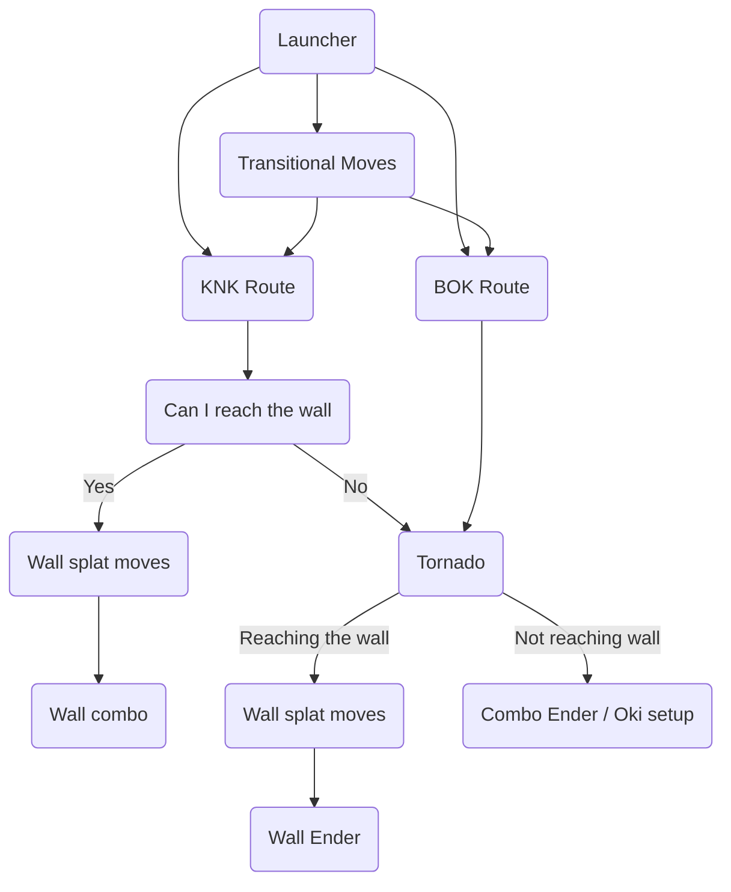

Using this chart we can start to break down a basic combo into it's parts
lets use the following:  

### Combo anatomy

#### KNK Route anatomy

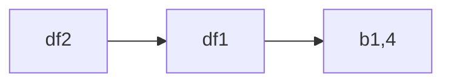

Using the chart above this is:  

From here we now have choices as we're in KNK stance, some of the carry
options are:

If you think you can hit the wall:

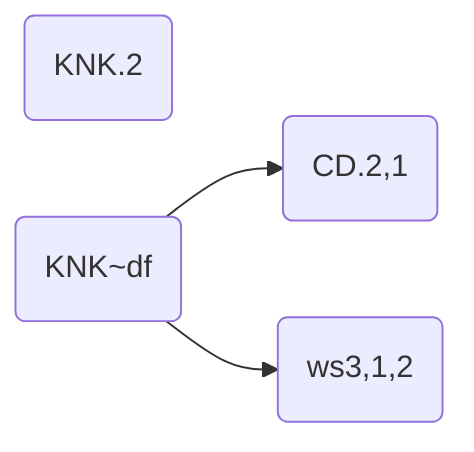

These are our wall splat moves.

If you don't think you can reach the wall you can add this into the
combo **ONCE**

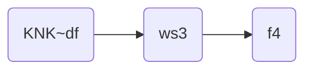

This will give you more carry and put you back into KNK stance where you
can do one of the wallsplats above

If after you've added this in you still don't think you can reach the wall
you can tornado with

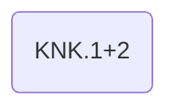

So putting this all together we'd get something that would potentially
look like

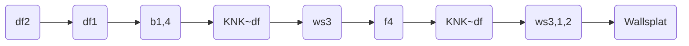

From here you can do your wall combo with a Tornado as you've still not
used your tornado at this point  

[Click here for more on wall combos](#wall-combos)

If you're not reaching the wall you'd replace the combo ender with

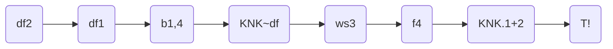

### Default Combo Starters

A lot of Leo's launchers share very similar combo routes, these launchers
are:

- `df+2`
- `uf+4`
- `ws2`
- `f,F+4`
- `KNK.3`

From these we can go with either KNK or BOK routes

#### KNK Route Options

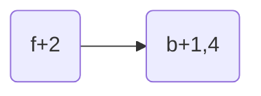

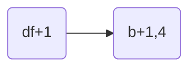

::: details

- This is recommended when off-axis to the right
- medium-low damage with easy execution (df+1 especially)
:::

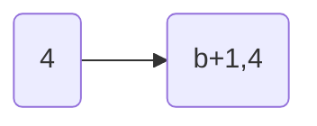

::: details

- 2 more damage than `f+2` route
- easy execution with lots of time to hit
- doesn't work off axis on SSR side

:::

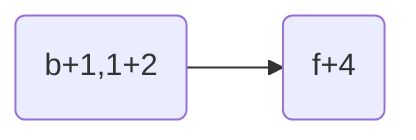

::: details

- 3 more damage than `f+2`
- Better Wall carry
- tighter execution
:::

#### BOK Route Options

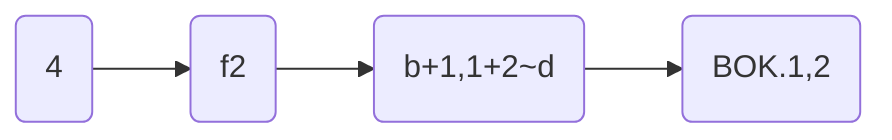

::: details

- Max damage `df2` combo
- Drops at tip `df2` range
  
:::

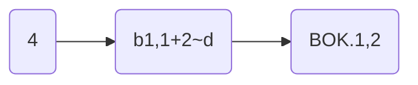

::: details

- 1-3 less damage than max damage route above
- drops at tip range
- works off-axis in SSL direction
:::

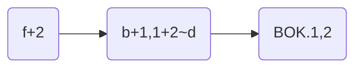

::: details

- 3-5 less damage than max damage
- works off axis in both directions and at tip range

:::

### Wall Combos

There are two main routes here, depending on if you've used your tornado
earlier on or not these are  

#### With Tornado

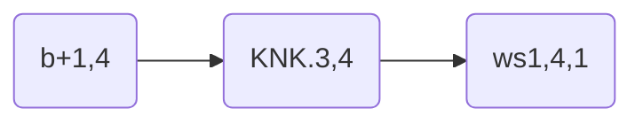

This is very reliable and gives you great Oki

#### Without Tornado

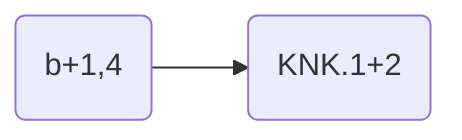

This gives you the best compromise of damage and oki

### Mini Combos

::: details
`CH 4`
~ `f+1+2`

`CH df+1,2` or `(df+1),2`
~ `d+4`

`CH (df+1),2` or `CH (ws3,1),2`
~ `f,F+2` (44; 14)  
`f+1+2` (43; 13)

`f,F+3~d`
~ `BOK.2`

`uf+2,1`
~ `d+4,2`

`CH f+3` or `CH (KNK.4)`
~ `d+4,2`

`CH f+3,d`
~ `BOK.2`, `df+4`

`f+2,4,LTG.3`
~ `f,f+3`

`CH SS.1+2` or `CH (f+2),2` or `CH (CD.2),1`
~ `dash`, `d+4,2`

`ub+1.P.4` or `CH b+1+4`
~ `b+2,1+2`

`CH f+4`
~ `KNK.1,2` (Heat)  
`KNK.2`

`CH d+1`
~ `d+3+4`

`CH CD.1`
~ `ws4, 1+2`

`FC.df+3`
~ `d+1+2`, `BOK.2`
:::

## Stances

### KNK

#### KNK Transitions

| Move    | Block | Hit  | CH  | Notes                  |
| ------- | ----- | ---- | --- | ---------------------- |
| b+3+4   |       |      |     | Creates space          |
| 1,2~b   | -9    | +2   |     |                        |
| b+3,1~b | -10   | +1   |     |                        |
| CD.2    | -9    | +9   |     |                        |
| BOK.4   | +9    | +15g | +19 | Same move as f+4       |
| f+4     | +9    | +15g | +19 | Same move as BOK.4     |
| 3,2,4   | +9    | +15g | +19 | Combo from 2nd CH      |
| 1,4     | -5    | +11  |     | Jail from first attack |
| b+1,4   | +9    | +15g | +19 | Combo from 1st CH      |
| b+4,1~4 | +9    | +15g | +19 |                        |

::: details

`b+4,1~4`
~ Combo from first hit  
Enter CD with df at -5 +1 +5

:::

#### KNK Options

| Move | Block | Hit  | CH   |
|------|-------|------|------|
| 1,2  | -9    | +17  |      |
| 2    | -9    | +22a | +58a |
| 3    | -13   | +28a |      |
| 3,4  | -12   | +80a |      |
| 4    | -12   | +4c  | +17d |
| 3+4  | -26   | +19d |      |
| 1+2  | -6    | +21  | +41a |
| 2+3  | -13   | +31a |      |
| df   |       |      |      |

::: details
`KNK.1,2`
~ Heat Engager  
Guaranteed `CH f+4`

`KNK.2`
~ CH launcher  
Balcony Break

`KNK.4`
~ Can go into Crouch Dash at -10, +6c, +19d

`KNK.3+4`
~ Low sweep that high crushes

`KNK.1+2`
~ Safe mid CH Launcher

`KNK.2+3`
~ Leo's second heat smash, low start
:::

### BOK

#### BOK Transitions

| Move        | Block | Hit  | CH   | Notes                      |
|-------------|-------|------|------|----------------------------|
| d+1+2       |       |      |      |                            |
| b+1,1+2~d   | -10   | +11  |      | NC on first hit            |
| 3,2~d       | -6    | +5   |      |                            |
| f+3~d       | +2    | +6   | +29a |                            |
| db+1+2~d    | -12   | +4   |      |                            |
| b+3,1~d     | -8    | +5   |      | Spike   NC on first hit |
| uf+2        | -11   | +21a |      |                            |
| f,F+3~d     | +0    | +10d |      |                            |
| ws3,1~d     | -10   | +9   |      | Alternative input CD.3,1   |
| f+2,4,LTG.3 | +4c   | +19d |      | Need Lightning glare       |
| KNK.1       | -7    | +4   |      |                            |

#### BOK Options

| Move    | Block | Hit  | CH  | Properties                                                                           | Notes                                           |
|---------|-------|------|-----|--------------------------------------------------------------------------------------|-------------------------------------------------|
| BOK.2   | -9    | +41a |     |                                                                                      | Can't interrupt from b+1,1+2 transition on hit  |
| BOK.3   | +5    | +15d |     | Homing   Balcony Break   Chip on block                                         | High, low crushing                              |
| BOK.1   | -4    | +9   |     |                                                                                      | Fastest option, can go for CHs afterwards at +9 |
| BOK.1,2 | -14   | +72  |     | Tornado   NC on 1st hit                                                           |                                                 |
| BOK.4   | +9    | +15g | +19 | Recovers in KNK                                                                      |                                                 |
| BOK.1+2 | -12   | +15d |     | Heat Engager   Heat Dash +5 +17d   Balcony Break   Spike   Chip on block |                                                 |

## Lightning Glare (LTG)

Lightning Glare is Leo's new install mechanic in Tekken 8, it grants them extensions to certain strings when active.

It is always usable in heat, and gives you one use after leaving heat.

### Getting LTG

| Move       | Block | Hit  | CH  | Properties                                               | Notes                  |
|------------|-------|------|-----|----------------------------------------------------------|------------------------|
| 1+2+3+4    |       |      |     |                                                          | Gain LTG               |
| d+4,2~1+2  | -5    | -11d | -1d |                                                          | NC On first hit        |
| b+1+3,P.2  | -9    | -9a  |     | Balcony Break   Combo from parry   Gain LTG on hit |                        |
| uf+1,2~1+2 | -14   | +22g |     | Balcony Break   NC from first hit                     |                        |
| f,F+2~1+2  | -9    | -9a  |     |                                                          |                        |
| ws1+2~1+2  | -15   | +3   |     |                                                          | Alternate input CD.1+2 |

### Moves in LTG

| Move           | Block | Hit  | CH | Properties                                                     | Notes                                                              |
|----------------|-------|------|----|----------------------------------------------------------------|--------------------------------------------------------------------|
| f+2,4,LTG.3    | +1c   | +16d |    | Balcony Break   Spike   Chip on block   NC on 1st hit | Enter BOK with d +4c +19d   Wallsplats   full jailing string |
| db+4,1,LTG.1+2 | -15   | +6a  |    | Balcony Break   Chip on block   NC on 1st hit            | Can confirm the followup from the hellsweep                        |
| b+3,1,LTG.2    | -13   | +10a |    | Balcony Break   Chip on block   NC on 1st hit            | Hit confirm the 2                                                  |
